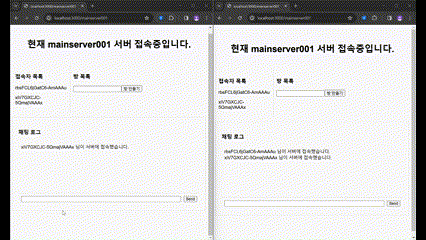

# websocketPJT

## 프로젝트 설명
웹 소켓을 활용하여 프로젝트를 진행하였습니다. 
최종적으로는 다중 사용자가 함께 진행할 수 있는 기능을 만들어 보려 합니다. 
현재까지 채팅 기능 구현 완료했습니다. 
백엔드와 프론트엔드 모두 스스로 구현하고 있습니다. 
개발하면서 알게 된 점이나 깨달은 점들은 폴더 내부의 readme.md 파일에 작성했습니다.

## FrontEnd
사용 기술: React.js, webSocket, axios

## BackEnd
사용 기술: express.js, webSocket

### 환경 변수
- `PORT`: 백엔드 서버 포트입니다. 기본값은 `8000`입니다.
- `ALLOWED_ORIGINS`: CORS 허용 origin 목록입니다. 쉼표로 구분하며 기본값은 `http://localhost:5173`입니다.
- `STATE_PATH`: 서버 상태 저장 파일 경로를 지정합니다. 지정하지 않으면 `BackEnd/state.json`을 사용합니다.

## Socket 이벤트 목록

### 로비 네임스페이스 (`/{nsp}`)
- `send_message` (client → server): `string`
- `receive_message` (server → client): `string`
- `create_room` (client → server): `''` (방 생성 트리거)
- `create_room` (server → client): `''` (방 목록 갱신 트리거)
- `delete_room` (server → client): `''` (방 목록 갱신 트리거)
- `connect_user` (server → client): `''` (접속자 목록 갱신 트리거)
- `disconnect_user` (server → client): `''` (접속자 목록 갱신 트리거)
- `server_full` (server → client): `string` (접속 불가 안내)
- `error` (server → client): `{ message: string }` (검증 오류 등)

### 방 네임스페이스 (`/{nsp}/{room}`)
- `send_message` (client → server): `string`
- `receive_message` (server → client): `string`
- `send_image` (client → server): `{ data: ArrayBuffer | Buffer | string(base64), mimeType?: string }`
- `receive_image` (server → client): `{ data: Buffer, mimeType: string }`
- `server_full` (server → client): `string` (접속 불가 안내)
- `error` (server → client): `{ message: string }` (검증 오류 등)

## 특기점

### throttle을 이용한 서버 갱신

### 로비 채팅 기능

### 방 생성 시 목록 자동 갱신

### 방 채팅 기능

### 방 이미지 전송 기능

